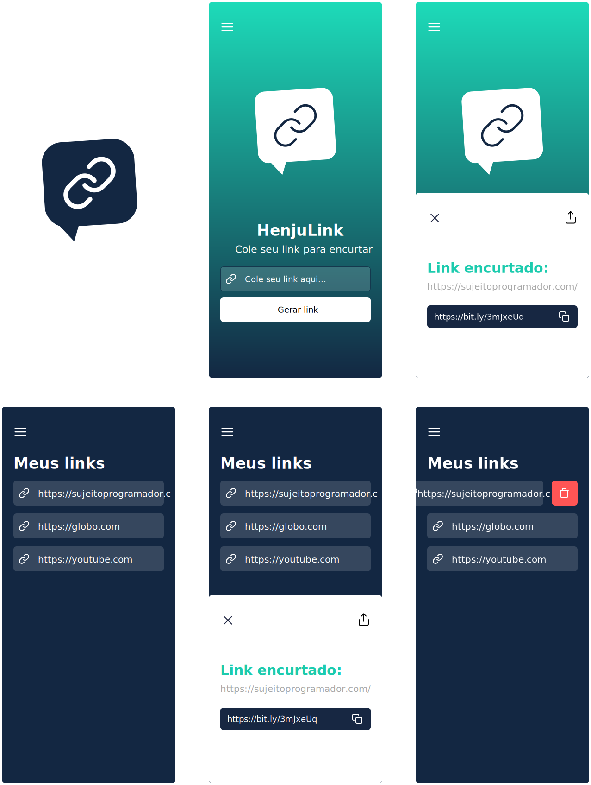

<h1 align="center">
  
  <br />
  <a href="https://www.linkedin.com/in/luis-henrique-0599b8178">
    
  </a>
  <a href="https://github.com/Henju-code/HenjuLink/blob/master/LICENSE">
    
  </a>
  <a href="https://github.com/henju-code/HenjuLink/issues">
    
  </a>
  <a href="https://github.com/henju-code/HenjuLink/issues?q=is%3Aissue+is%3Aclosed">
    
  </a>
  <a href="https://github.com/henju-code/HenjuLink/network">
    
  </a>
  <a href="https://github.com/henju-code/HenjuLink/stargazers">
    
  </a>
</h1>
<p align="center">
  <a href="#page_facing_up-descrição">Descrição</a>&nbsp;&nbsp;&nbsp;|&nbsp;&nbsp;&nbsp;
  <a href="#art-Layout">Layout</a>&nbsp;&nbsp;&nbsp;|&nbsp;&nbsp;&nbsp;
  <a href="#-tecnologias">Tecnologias</a>&nbsp;&nbsp;&nbsp;|&nbsp;&nbsp;&nbsp;
  <a href="#clipboard-Funcionalidades">Funcionalidades</a>&nbsp;&nbsp;&nbsp;|&nbsp;&nbsp;&nbsp;
  <a href="#closed_book-instalação">Instalação</a>&nbsp;&nbsp;&nbsp;|&nbsp;&nbsp;&nbsp;
  <a href="#man-Autor">Autor</a>&nbsp;&nbsp;&nbsp;|&nbsp;&nbsp;&nbsp;
  <a href="#memo-Licença">Licença</a>
</p>



## :page_facing_up: Descrição
O HenjuLink é um app para encurtar, salvar e compartilhar seus links favoritos.

## :art: Layout
Você pode acessar o Layout pelo <a href="https://www.figma.com">Figma<a> atravês <a href="https://www.figma.com/file/1Q0bnpN8DmdMNB1rz2Zr1O/Insider-3.0-Copy?node-id=4204%3A4">desse link<a>.

## 🛠 Tecnologias
Este projeto foi desenvolvido com as seguintes tecnologias

- [React Native](https://reactnative.dev/)
- [Expo](https://expo.io/)
- [JavaScript](https://developer.mozilla.org/pt-BR/docs/Web/JavaScript/Guide/Introduction)
- [Styled Components](https://github.com/styled-components/styled-components)

## :clipboard: Funcionalidades
- [x] Encurtar link colado.
- [x] Copiar link encurtado para o clipboard.
- [x] Salvar link encurtado na aba "Meus Links".
- [x] Compartilhar links encurtados.
- [x] Remover links salvos.
- [x] Todos os dados são salvos no Local Storage do dispositivo.


## :closed_book: Instalação

### Pré-requisitos
Antes de começar, você vai precisar ter instalado em sua máquina as seguintes ferramentas:
[Git](https://git-scm.com), [Node.js](https://nodejs.org/en/), [Expo](https://expo.io/), um emulador ou dispositivo fisico usando o Expo Client para [IOS](https://apps.apple.com/br/app/expo-go/id982107779) ou [Android](https://play.google.com/store/apps/details?id=host.exp.exponent), Além disto é bom ter um editor para trabalhar com o código como [VSCode](https://code.visualstudio.com/)

</br>

### _Clone este repositório._
```bash
 git clone https://github.com/Henju-code/HenjuLink.git
```

### _Vá para a pasta HenjuLink_
```bash
 cd HenjuLink
```

### _Instale as dependências_
 ```bash
 npm install 
```

### _Execute aplicação_
```bash
 expo start
```

#### Para dispositivos fisicos: Leia o Código QR com o Expo Client que você baixou no seu dispositivo, não se esqueça de estar na mesma rede Wi-fi.

</br>

## :man: Autor

<a href="https://github.com/henju-code/">
 
 <br />
 <sub><b>Luis Henrique</b></sub>
</a>


Feito com ❤️ por Luis Henrique :wave::wave: Entre em contato!🚀

<a href="https://www.linkedin.com/in/luis-henrique-0599b8178">
  
</a>


## :memo: Licença

Copyright © 2021 [Luis Henrique](https://github.com/henju-code).<br />
This project is [MIT](./LICENSE) licensed.
